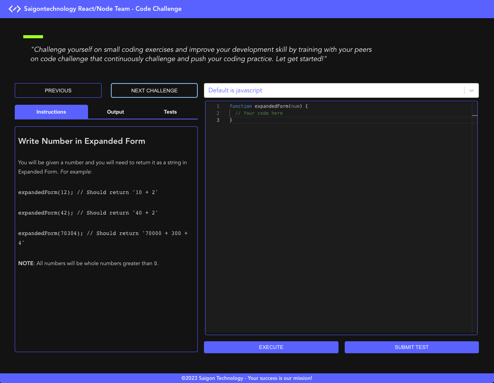

# Project: Code Challenge 
- Saigon Technology - 3rd January 2023

## Overview
The project is intended to provide an online code execution system that allows developers to write and execute code as well as validate their code challenge solving skill. The code execution is performed by robust, scalable, and open-source code execution system [Judge0](https://judge0.com/)

## Goals
1. Launch a friendly user interface for code editing and code challenge navigation
2. Support multiple programming languages to solve a specific problem 
3. Record training progress as well as allow their custom test suite to submit (T.B.D)
4. Testing Coverage: 95%

## Specification
The technology stack used in this project includes: 

1. Bundle tool: **Vite**
2. UI development: **ReactJS, Style Component**
3. State management: **Redux, ReduxToolkit**
4. API & Middleware: **RESTful & Redux Saga, Axios**
5. Unit & Automation Testing: **Vitest & Cypress.io**
6. Backend: **Judge0 (v1.13.0)** *deployed on a private cloud (Digital Ocean)*
7. Version control: **Git, GitHub**
8. CI/CD: **Buddy + AWS**
9. Methodology: **Trunk Based Development**
10. [Demo](http://code-challenge-sts.s3-website-us-west-1.amazonaws.com)

## Architecture

## Implementation

## Components
1. Instruction and output, code challenge navigation are on the left screen in desktop view  `(top screen in responsive mobile)`. This section is used for navigating and guiding users about the challenge content. It also provides the output and validation results when the users run their codes or submit their solutions to available test cases for validation.
2. Language selection and Code Editor are on the right screen in desktop view `(bottom screen in responsive mobile)`. This section provides the programming language list for selection and the online code editor.
3. Action buttons for code execution and test submission.

## Workflow
1. Code execution:
    - Compose your codes in the editor
    - Print out your code execution, i.e, `console.log(add(1, 2))` and hit the `Execution` button
    - The `Output` tab comes up and shows your output
2. Test your code
    - Compose your codes in the editor
    - **DO NOT** use any code to print out something in your solution, i.e, `console.log()`
    - Hit the `Submit Test` button
    - The `Tests` tab comes up and shows your test result

## How to run the project
This project was bootstrapped with [**vite**](https://vitejs.dev/) the next generation front end tooling.

### Available Scripts
in the project directory, you can run:

**`npm run dev`**

Runs the app in the development mode.
To expose the internal ip V4 address in the console, add the option `--host`.

Open http://localhost:5173 to view it in your browser.

**`npm run test`**

Launches the test runner in the interactive watch mode.

**`npm run build`**

Build the app for production to the `dist` folder.
It correctly bundles React in production mode and optimizes the build for the best performance.

The build is minified and filenames include the hashes.
Your app is ready to be deployed!

**`npm run preview`**

Serve the app from `dist` folder.

## Reference
Judge0 API [document]( https://ce.judge0.com/ ) 